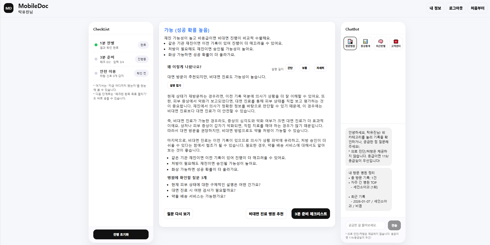
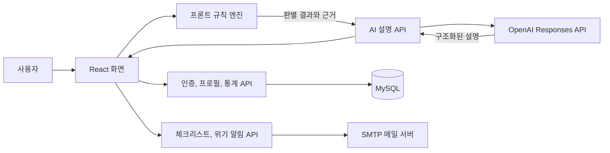

# MobileDoc Backend

> 비대면 진료를 시작하기 전에 사용자의 상황을 짧게 확인하고, 진행 가능성과 준비 사항을 이해하기 쉬운 말로 안내하는 서비스입니다.

[](https://openjdk.org/)
[](https://spring.io/projects/spring-boot)
[](https://www.mysql.com/)
[](https://platform.openai.com/docs/api-reference/responses)

## 프로젝트 소개

MobileDoc는 비대면 진료가 익숙하지 않은 사용자가 진료 가능 여부를 먼저 확인하고, 필요한 준비와 안전 정보를 한 화면에서 볼 수 있도록 만든 개인 풀스택 프로젝트입니다.

의료와 관련된 서비스에서는 AI가 그럴듯한 답을 만드는 것보다 정해진 기준을 벗어나지 않는 것이 더 중요하다고 생각했습니다. 그래서 진행 가능성은 프론트엔드의 규칙 엔진에서 판단하고, 백엔드는 그 결과와 근거를 받아 GPT-4o mini가 쉬운 설명으로 바꾸도록 구성했습니다. OpenAI API를 사용할 수 없을 때도 기본 안내가 끊기지 않도록 상황별 대체 응답을 함께 구현했습니다.

| 구분 | 내용 |
| --- | --- |
| 개발 형태 | 개인 프로젝트, 기획부터 프론트엔드와 백엔드 구현까지 담당 |
| 개발 기간 | 2025.12 - 2026.02 |
| 백엔드 | Java 17, Spring Boot, Spring Data JPA, MySQL |
| AI 연동 | OpenAI Java SDK, Responses API, GPT-4o mini |
| 관련 저장소 | [Frontend](https://github.com/ttyujin/MobileDoc-FE) / [Backend](https://github.com/ttyujin/MobileDoc-BE) |
| 화면 설계 | [Figma](https://www.figma.com/design/IrQ2dcEyOLBmGXVym3SwXw/%EB%B9%84%EB%8C%80%EB%A9%B4-3%EB%B6%84-%EC%B2%B4%ED%81%AC-%EB%A6%AC%EC%8A%A4%ED%8A%B8?t=88Yl3AC7xJcY8QK2-1) |

## 서비스 화면

### 비대면 진료 사전 확인

사용자가 1분 판별, 3분 준비, 안전 이용, 병원 추천 순서로 이동할 수 있도록 전체 흐름을 한 화면에 배치했습니다.


### 판별 결과와 다음 행동 안내

결과만 보여주는 데서 끝내지 않고, 결과가 나온 이유와 병원에 확인할 질문까지 이어지도록 구성했습니다.



## 백엔드에서 해결한 문제

### 1. 규칙 기반 판별과 AI 설명을 분리했습니다

AI가 진행 가능 여부를 임의로 결정하지 않도록 프론트엔드 규칙 엔진이 먼저 `decisionLevel`, `reasons`, `answers`를 만듭니다. 백엔드는 이 값을 OpenAI Responses API에 전달하고 아래 형태의 JSON 응답으로 정리합니다.

```json
{
  "summary": "결과를 한두 문장으로 요약",
  "detail": "규칙 기반 근거를 쉬운 말로 설명",
  "bullets": ["핵심 근거"],
  "ask": ["병원에 확인할 질문 1", "질문 2", "질문 3"]
}
```

프롬프트에는 전달된 근거만 사용하고 진단, 처방, 약 추천을 하지 않도록 제한을 두었습니다. 응급 표현이 감지되면 119 또는 응급실 안내가 답변에서 빠지지 않도록 후처리도 적용했습니다.

### 2. 외부 AI API가 실패해도 서비스 흐름을 유지했습니다

API 키가 없거나 호출 중 예외가 발생하거나 응답 형식이 맞지 않는 경우, 판별 단계와 설명 길이에 맞는 기본 응답을 반환합니다. 사용자가 결과 화면에서 멈추지 않도록 외부 API 실패를 서비스 실패와 분리했습니다.

### 3. 계정과 이메일 인증 흐름을 구현했습니다

- 회원가입과 비밀번호 재설정에 6자리 이메일 인증번호 적용
- 인증번호 유효시간 10분, 최대 시도 횟수 5회, 재전송 제한 60초 적용
- 비밀번호와 인증번호를 BCrypt로 해시 처리
- 가입 여부를 직접 노출하지 않는 동일 응답 방식 적용
- 이름을 통한 이메일 찾기와 이메일 일부 마스킹 구현

### 4. 사용자 기록과 알림 기능을 연결했습니다

- 사용자 프로필과 연락처, 방문 이력 저장 및 조회
- 최근 기간의 증상 기록 통계 조회
- 체크리스트 요약 메일 전송
- 위기 상황 발생 시 선택 연락처와 관리자에게 알림 메일 전송

## 시스템 구조



## 주요 API

| Method | Endpoint | 설명 |
| --- | --- | --- |
| `GET` | `/health` | 서버 상태 확인 |
| `POST` | `/ai/explain-decision` | 규칙 기반 판별 결과를 사용자용 설명으로 변환 |
| `POST` | `/ai/chat` | 방문 기록, 증상 통계, 최근 판별, 고객센터 질문 응답 |
| `POST` | `/auth/email/send-code` | 회원가입 또는 비밀번호 재설정 인증번호 발송 |
| `POST` | `/auth/email/verify-code` | 이메일 인증번호 확인 |
| `POST` | `/auth/signup` | 이메일 인증을 완료한 사용자 회원가입 |
| `POST` | `/auth/login` | 이메일과 비밀번호 로그인 |
| `POST` | `/auth/find-email` | 이름을 기준으로 마스킹된 이메일 조회 |
| `POST` | `/auth/password/reset-with-code` | 인증번호 확인 후 비밀번호 재설정 |
| `GET` | `/profile/{userId}` | 사용자 프로필 조회 |
| `PUT` | `/profile/{userId}` | 사용자 프로필과 연락처 저장 또는 수정 |
| `GET` | `/stats/symptoms` | 기간별 증상 통계 조회 |
| `POST` | `/alerts/checklist` | 체크리스트 결과 요약 메일 전송 |
| `POST` | `/alerts/emergency` | 보호자와 관리자에게 위기 상황 메일 전송 |

## 기술 스택

| 영역 | 사용 기술 |
| --- | --- |
| Language | Java 17 |
| Framework | Spring Boot 4.0.1, Spring MVC |
| Data | Spring Data JPA, MySQL |
| Validation | Jakarta Validation |
| Security | Spring Security Crypto, BCrypt |
| AI | OpenAI Java SDK 4.15.0, Responses API, GPT-4o mini |
| Mail | Spring Mail, Gmail SMTP, Naver SMTP |
| Build and Test | Gradle, JUnit Platform |

## 프로젝트 구조

```text
src/main/java/com/mobiledoc/mobiledocbackend
├── ai          # AI 설명, 챗봇, OpenAI API 연동
├── alerts      # 체크리스트 요약과 위기 상황 메일
├── auth        # 회원가입, 로그인, 이메일 인증, 비밀번호 재설정
├── config      # CORS, 메일, 비밀번호 암호화, 예외 처리
├── controller  # 서버 상태 확인
├── profile     # 프로필, 연락처, 방문 이력
├── stats       # 증상 기록과 통계
└── user        # 사용자 엔티티와 저장소
```

## 실행 방법

### 1. 사전 준비

- Java 17
- MySQL 8 이상
- OpenAI API Key
- 메일 기능을 사용할 경우 Gmail 또는 Naver SMTP 계정

MySQL에 `mobiledoc` 데이터베이스를 생성하고 `application.properties`의 접속 정보를 개발 환경에 맞게 설정합니다.

```sql
CREATE DATABASE mobiledoc
  CHARACTER SET utf8mb4
  COLLATE utf8mb4_unicode_ci;
```

### 2. 환경 변수 설정

Windows PowerShell 예시입니다.

```powershell
$env:OPENAI_API_KEY = "your-openai-api-key"
$env:MOBILEDOC_DB_PASSWORD = "your-db-password"
$env:MOBILEDOC_GMAIL_USERNAME = "your-email"
$env:MOBILEDOC_GMAIL_APP_PASSWORD = "your-app-password"
$env:MOBILEDOC_ADMIN_EMAIL = "your-admin-email"
```

메일 발송이 필요하지 않다면 메일 관련 환경 변수는 생략할 수 있습니다. OpenAI API Key가 없는 경우에도 기본 안내 응답으로 동작합니다.

### 3. 서버 실행

```bash
git clone https://github.com/ttyujin/MobileDoc-BE.git
cd MobileDoc-BE
```

Windows:

```powershell
.\gradlew.bat bootRun
```

macOS 또는 Linux:

```bash
./gradlew bootRun
```

서버는 기본적으로 `http://localhost:8081`에서 실행됩니다.

```text
GET http://localhost:8081/health
Response: ok
```

## 개발 방식

기능을 바로 코딩하기보다 먼저 Claude로 사용자 흐름과 필요한 상태를 정리하고, Figma에서 화면 순서를 확인한 뒤 프론트엔드를 구현했습니다. 이후 화면에서 실제로 필요한 데이터 구조를 기준으로 Spring Boot API와 MySQL 테이블을 연결했습니다.

Codex는 코드 수정과 오류 원인 확인에 활용했습니다. 다만 제안된 코드를 그대로 끝내지 않고 직접 실행하면서 요청값, 응답값, 예외 상황을 다시 확인했습니다. 이 과정을 반복하면서 프론트엔드 화면과 백엔드 API가 실제 사용 흐름 안에서 맞물리도록 조정했습니다.

## 다음 개선 계획

- 세션 또는 JWT 기반 인증과 사용자별 접근 제어 추가
- Testcontainers를 활용한 인증, AI 대체 응답, 메일 실패 시나리오 통합 테스트 작성
- OpenAI 호출의 시간 제한, 재시도 정책, 요청 추적 로그 보강
- 프롬프트 버전과 응답 품질을 비교할 수 있는 평가 기록 추가
- 현재 목업으로 구성된 병원 목록을 실제 위치 기반 병원 API와 연결

## 의료 안전 안내

MobileDoc는 의료 진단이나 처방을 제공하는 서비스가 아닙니다. 증상이 심하거나 응급 상황이 의심되면 비대면 안내보다 119 또는 응급실의 도움을 먼저 받아야 합니다.

## 만든 사람

탁유진

- GitHub: [github.com/ttyujin](https://github.com/ttyujin)
- Frontend: [MobileDoc-FE](https://github.com/ttyujin/MobileDoc-FE)
- Backend: [MobileDoc-BE](https://github.com/ttyujin/MobileDoc-BE)
